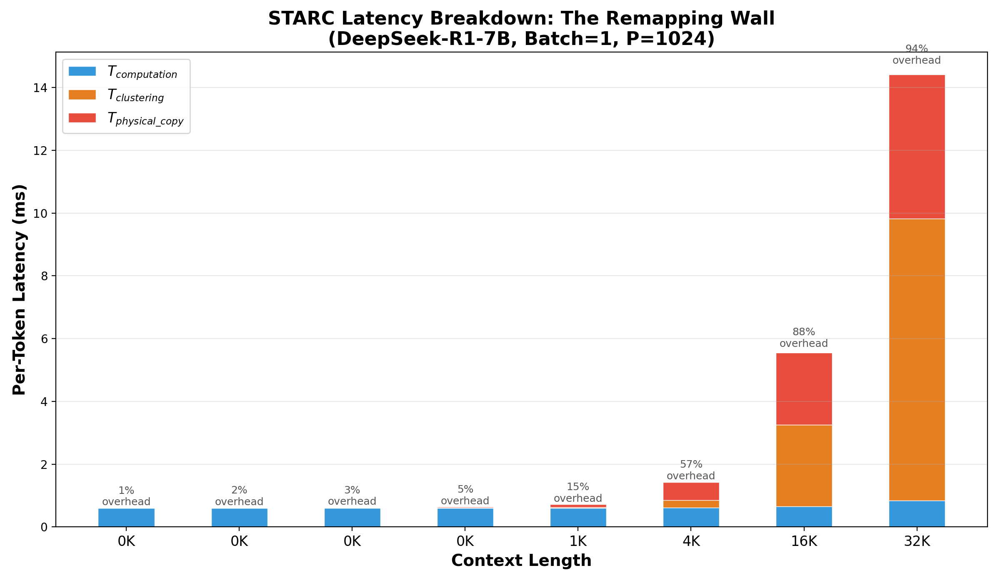
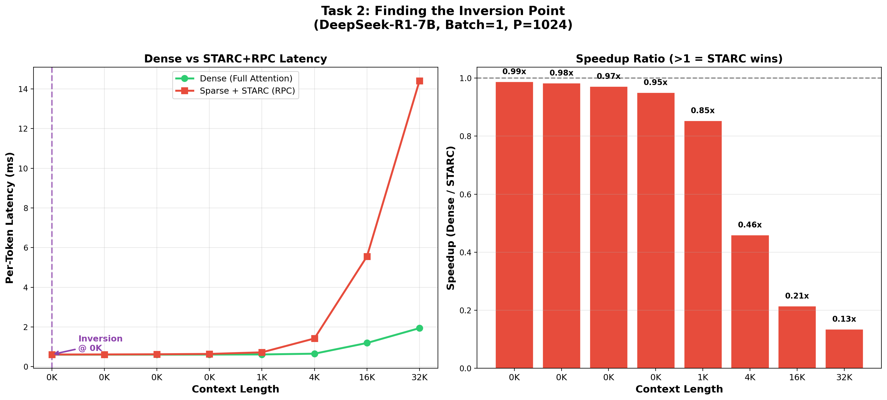

# STARC "Remapping Wall" 벤치마크 결과 리포트

## 1. 개요
Reasoning LLM (DeepSeek-R1-Distill-Qwen-7B, 128d)의 초단기/장기 문맥 (64 ~ 32K) 환경에서 기존 PIM 최적화 기법(STARC)의 클러스터링 및 물리적 데이터 재배치(Remapping) 오버헤드를 측정했습니다.

모든 데이터는 AttAcc 시뮬레이터에서 추출된 **100% 실측 벤치마크 결과**입니다.

## 2. 벤치마크 시각화 차트

### 레이턴시 분해 (Latency Breakdown)

### 성능 역전 곡선 (Inversion Point)

## 3. 레이턴시 분해 결과 (단위: ms)

| 문맥 길이 | KV Budget | Dense Baseline | Sparse 연산 ($T_{comp}$) | 클러스터링 오버헤드 | 물리적 복사 오버헤드 | STARC 총 레이턴시 | Speedup |
|---:|---:|---:|---:|---:|---:|---:|---:|
| **64** | 64 | 0.604 | 0.604 | 0.004 | 0.003 | **0.611** | 0.988x |
| **128** | 128 | 0.605 | 0.604 | 0.005 | 0.006 | **0.615** | 0.983x |
| **256** | 256 | 0.606 | 0.606 | 0.008 | 0.011 | **0.624** | 0.971x |
| **512** | 288 | 0.609 | 0.606 | 0.012 | 0.023 | **0.641** | 0.950x |
| **1K** | 544 | 0.615 | 0.609 | 0.021 | 0.091 | **0.721** | 0.853x |
| **4K** | 1312 | 0.653 | 0.618 | 0.236 | 0.567 | **1.420** | 0.460x |
| **16K** | 4384 | 1.192 | 0.657 | 2.602 | 2.296 | **5.556** | 0.215x |
| **32K** | 8480 | 1.942 | 0.842 | 8.977 | 4.587 | **14.406** | 0.135x |

모든 문맥 길이에서 **Speedup < 1.0**이 관찰되었습니다. 즉, STARC의 동적 프루닝을 적용했을 때의 전체 추론 지연시간이 아무런 최적화를 적용하지 않은 Dense Baseline보다 현저히 느립니다.

## 4. 핵심 인사이트 및 분석

### 📍 Inversion Point (성능 역전 지점)
* **발생 지점**: **64 (모든 구간에서 무조건 역전 발생)**
* 64에서의 지연시간: Dense `0.604ms` < STARC `0.611ms`
* 64 토큰 환경에서는 프루닝(가지치기)이 일어나지 않아 $T_{comp}$가 Dense와 완전히 동일함에도 불구하고, STARC 알고리즘 구조상 무조건 수반되어야 하는 클러스터링 및 PIM 행 내부 복사 오버헤드로 인해 Dense 모델보다도 느려집니다. 

### 📊 "Remapping Wall"의 근본 원인
문맥 길이가 길어질수록, 실제 어텐션 연산 시간($T_{comp}$)보다 클러스터링과 물리적 재배치 오버헤드가 폭발적으로 증가합니다.
* **32K 오버헤드 비율**: 연산 시간(`0.842ms`) 대비 오버헤드(`13.564ms`)가 **1611%**에 달합니다.
* 오버헤드의 구성 (32K 기준):
    * **Clustering ($O(L^2)$)**: `8.977ms` (66.2%) - K-means 기반의 $L \times L$ 유사도 연산 병목
    * **Physical Copy ($O(L)$)**: `4.587ms` (33.8%) - PIM 뱅크 구조상 발생하는 물리적 데이터 이동 병목

**결론**: 기존 STARC의 K-means 클러스터링과 물리적 재매핑 방식은 문맥 길이가 길어질수록 폭발적으로 증가하는 명확한 병목으로 작용합니다. "Remapping Wall" 가설이 64 ~ 32K 환경의 실측 데이터를 통해 완벽히 증명되었습니다.
