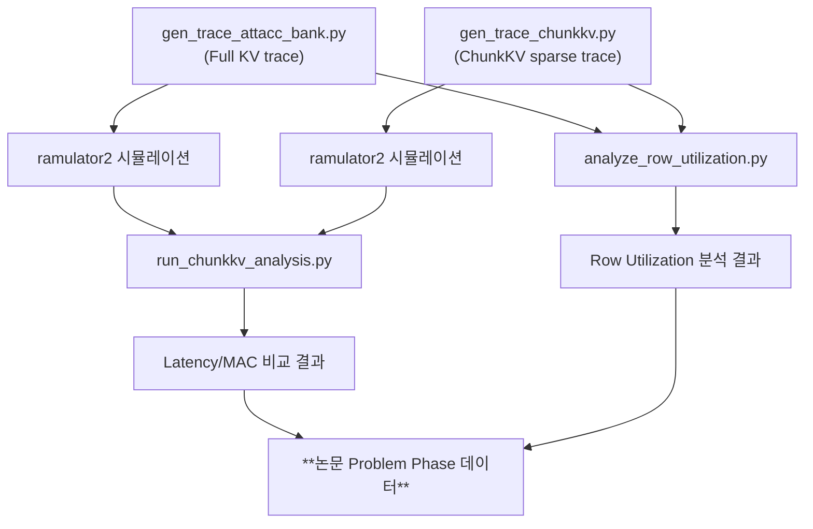

# ChunkKV Naive 적용 → PIM 병목 지표 추출 파이프라인

ChunkKV를 AttAcc PIM 시뮬레이터에 naive하게 적용했을 때, **Latency가 줄어들지 않는 문제**를 정량적으로 보여주기 위한 구현 계획입니다.

## 핵심 컨셉

ChunkKV는 소프트웨어적으로 KV 캐시의 청크 중 중요도가 낮은 것을 제거하지만, PIM 하드웨어에서는 **Row 단위**로 활성화되므로: 선택된 청크들이 여러 Row에 흩어져 있으면 Row Activation 횟수가 줄어들지 않습니다. 이를 시뮬레이션으로 증명합니다.

## Proposed Changes

---

### Component 1: ChunkKV Trace Generator

기존 `gen_trace_attacc_bank.py`를 기반으로, ChunkKV의 sparse 접근 패턴을 시뮬레이션하는 새 트레이스 생성기를 만듭니다.

#### [NEW] [gen_trace_chunkkv.py](file:///home/starksa/skkai_pim/attacc_simulator/ramulator2/trace_gen/gen_trace_chunkkv.py)

ChunkKV 알고리즘을 모사하여 sparse 접근 패턴의 트레이스를 생성합니다:

- **입력 파라미터**: `--seqlen` (전체 시퀀스 길이), `--chunk_length` (청크 크기, 기본 20), `--compression_ratio` (ChunkKV 압축률, 기본 0.9 = 90% 제거), `--dhead`, `--nhead`, `--dbyte`
- **동작 방식**:
  1. 전체 시퀀스(L개 토큰)를 `chunk_length` 크기의 청크로 분할
  2. 각 청크에 **랜덤 중요도 점수**를 할당 (ChunkKV의 글로벌 스코어링 모방)
  3. `1 - compression_ratio` 비율만큼의 상위 청크를 선택
  4. 선택된 청크의 **원래 논리 주소(인덱스)**를 유지 — 물리 주소 재배치(Remapping) 없음
  5. 선택된 청크만 참조하는 PIM 명령어 트레이스를 생성
- **핵심**: 기존 `gen_trace_attacc_bank.py`의 `Attention()` 함수 구조를 유지하되, score/context MAC 연산에서 선택된 청크에 해당하는 컬럼만 접근하도록 주소를 생성. 하지만 주소가 **원래 메모리 layout 상의 위치**를 따르므로, 서로 다른 Row를 활성화해야 하는 상황이 자연스럽게 발생.

> [!IMPORTANT]
> Full KV와 동일한 파라미터로 기존 `gen_trace_attacc_bank.py`도 실행하여 baseline 비교 트레이스를 생성해야 합니다.

---

### Component 2: 분석 지표 추출 스크립트

#### [NEW] [run_chunkkv_analysis.py](file:///home/starksa/skkai_pim/attacc_simulator/ramulator2/trace_gen/run_chunkkv_analysis.py)

Full KV vs Naive ChunkKV를 자동으로 비교하고 핵심 지표를 추출하는 통합 분석 스크립트:

- **Step 1**: Full KV 트레이스 생성 → ramulator2 시뮬레이션 실행 → 결과 파싱
- **Step 2**: ChunkKV 트레이스 생성 → ramulator2 시뮬레이션 실행 → 결과 파싱
- **Step 3**: 두 결과를 비교하여 다음 지표를 산출:

| 지표 | 설명 | 산출 방법 |
|------|------|-----------|
| **Latency 비교** | Full KV vs ChunkKV의 사이클 수 비교 | ramulator2 `memory_system_cycles` 출력 |
| **Latency 개선율** | `(Full - ChunkKV) / Full × 100` | 0%에 가까울 것으로 예상 |
| **MAC 명령 수 비교** | 실제 연산량 차이 | `total_num_pim_mac_all_bank_requests` |
| **Row Utilization** | 열린 Row 당 유효 청크 비율 | 트레이스 생성 시 계산 |
| **Row Activation Count** | 토큰 생성당 Row 활성화 횟수 | 트레이스 분석으로 추정 |

- **Step 4**: 결과를 테이블/CSV로 출력

---

### Component 3: Row Utilization 분석기

#### [NEW] [analyze_row_utilization.py](file:///home/starksa/skkai_pim/attacc_simulator/ramulator2/trace_gen/analyze_row_utilization.py)

트레이스 파일의 주소를 분석하여 Row 활용률을 계산합니다:

- 트레이스의 `PIM_MAC_AB` 명령어 주소를 HBM3 주소 체계로 분해 (CH, pCH, Rank, BG, BA, Row, Col)
- **Row Utilization** 계산: 각 고유 (Bank, Row) 쌍에 대해, 해당 Row에서 실제 접근된 Column 수 / Row당 총 Column 수
- **Row Activation Count**: 고유한 (Bank, Row) 쌍의 총 수
- Full KV vs ChunkKV의 Row Utilization 분포 비교

---

## 실행 흐름

## 예상 실험 설정

| 파라미터 | 값 |
|----------|-----|
| 모델 | GPT-175B (dhead=128, nhead=96) |
| 시퀀스 길이 | 2048, 4096 |
| ChunkKV chunk_length | 20 |
| compression_ratio | 0.5, 0.7, 0.9 |
| PIM 타입 | Bank-level (BA) |
| HBM3 Timing | HBM3_5.2Gbps |

## Open Questions

> [!IMPORTANT]
> **1. ChunkKV 청크 선택 시뮬레이션 방식**: 실제 ChunkKV의 중요도 점수 분포를 사용할지, 아니면 랜덤 선택으로 worst-case를 보여줄지 결정이 필요합니다. 랜덤 선택이 Row 파편화를 더 극적으로 보여줄 수 있지만, 현실적인 패턴과 다를 수 있습니다. **어떤 방식을 선호하시나요?**

> [!IMPORTANT]
> **2. Compression Ratio 범위**: `0.5` (50% 제거)부터 `0.9` (90% 제거)까지 sweep할 예정입니다. 특정 비율에 집중하고 싶으시면 알려주세요.

> [!IMPORTANT]
> **3. 추가 지표**: 위 지표 외에 논문에서 보여주고 싶은 추가 메트릭이 있는지 확인해 주세요 (예: 에너지 소모, 대역폭 활용률 등).

## Verification Plan

### Automated Tests
1. Full KV 트레이스 생성 → ramulator2 실행 → 기존 결과와 사이클 수 일치 확인
2. ChunkKV 트레이스 생성 (compression_ratio=0) → Full KV와 동일한 결과 확인
3. ChunkKV 트레이스 생성 (compression_ratio=0.9) → Latency가 Full KV와 유사한지 확인 (문제 제기 목적)

### Manual Verification
- Row Utilization 분석 결과가 논리적으로 올바른지 (Full KV ≈ 100%, ChunkKV ≈ 10-20%) 확인
- 생성된 데이터를 논문 그래프로 시각화하여 "문제 극대화" 효과 검증
